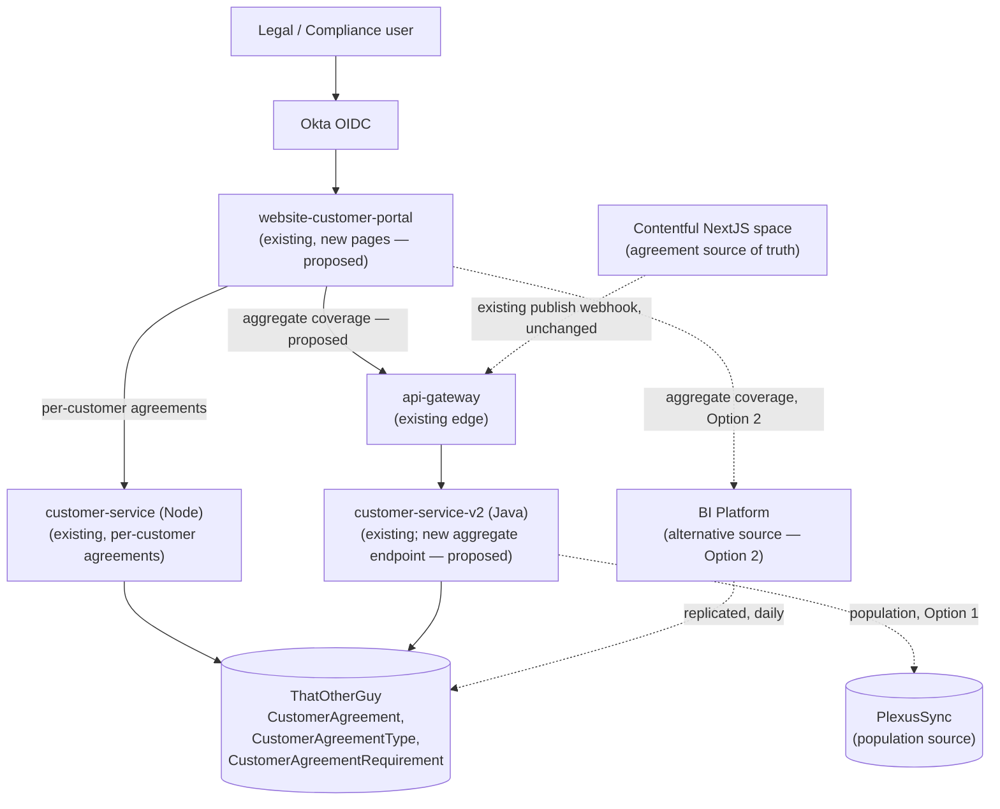
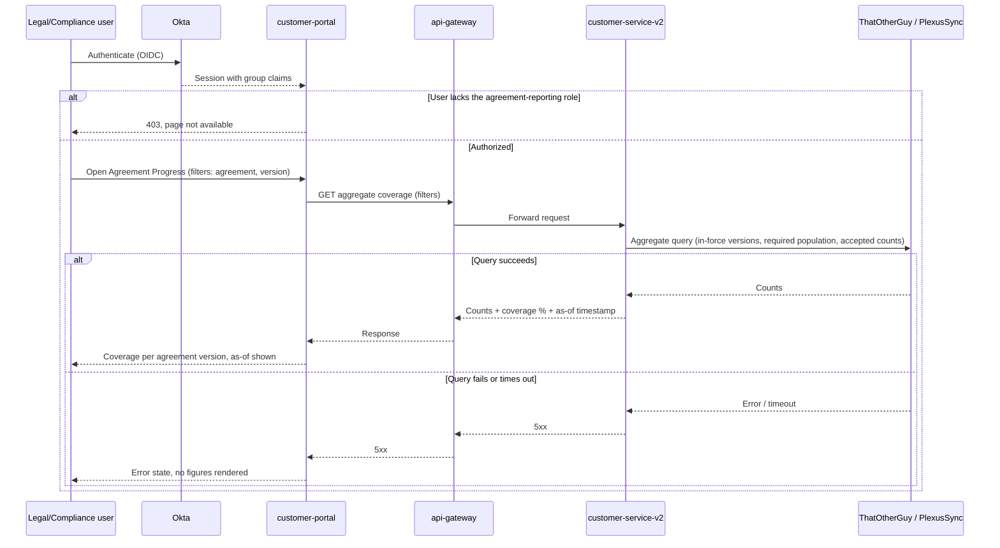
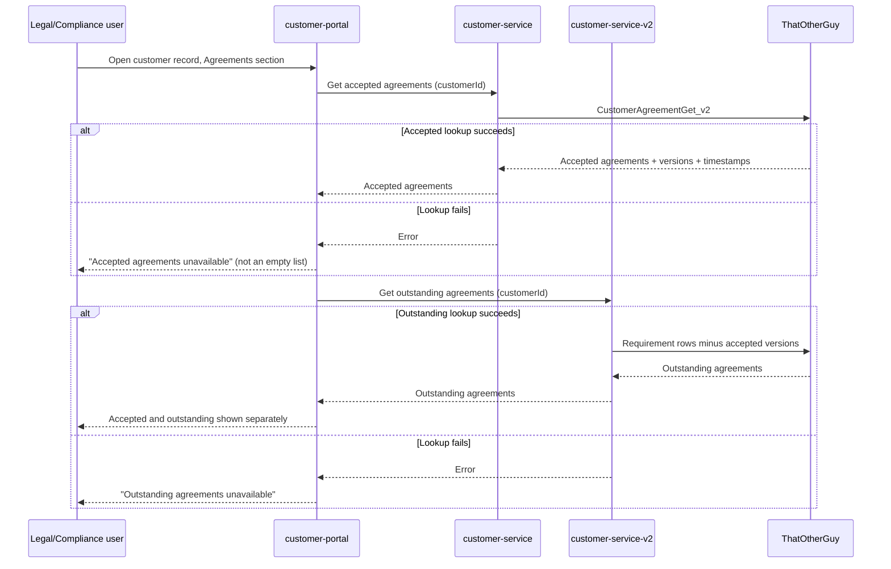

# Architecture Approach - Ambassador Agreement Acceptance Reporting

Status: draft for architect review. This document is a proposal. It is not ARB approval, a department sign-off, or evidence that the design was validated in a proof of concept beyond what the sources state.

## Document Revision

| Changes By | Change Date | Purpose |
| --- | --- | --- |
| *(architect to complete)* | 2026-09-29 | Initial draft assembled from the accepted BRD [B1], architect notes [A1], the CP-51264 spike [R5, R6], the terms-gate AAD and its decision records [R7, R8, R9, R10, R11, R12, R13], the PLAN-818 release plan [R14], the Contentful authoring spec [R15], the reports-service-v3 decommission epic [R21, R22], and the customer-portal decision records [R23, R24, R25, R26]. |

## Document Acceptance

| Department | Representative | Approval Status (NOT APPROVED / CONDITIONAL / APPROVED) | Notes |
| --- | --- | --- | --- |
| Enterprise Architecture | | | |
| Product Engineering | | | |
| Data Engineering | | | Owns the aggregate query path and any stored procedure work [R6 Direct Retrieval]. |
| DevOps | | | |
| Marketing | | | |
| Sales | | | |
| Product Management/Owner | | | |
| Quality Assurance | | | |
| Security Engineering/Compliance | | | |
| IT Operations | | | |
| Business Systems Analysis | | | |
| Legal | | | Named as the consuming department throughout [B1, R2, R3, R4]. |
| Business Intelligence | | | Required only if the BI Platform option is chosen [R6 Business Intelligence Platform]. |

## Overview

### Scope of the Document

This document describes the architecture approach for giving Legal/Compliance on-demand visibility into Brand Ambassador agreement acceptance, without a data pull request to Engineering [B1 §Requirements 1, R3 Acceptance Criteria]. It covers where the reporting surface lives, how acceptance data is read, and what must be added to produce aggregate coverage figures.

Success criteria carried from the BRD [B1 §Success Metrics], all candidates pending validation:

- Manual data pull requests to Engineering or another team for acceptance data fall to zero [B1 §Success Metrics 1].
- Time to answer a Legal/Compliance acceptance question, from request to answer, is reduced [B1 §Success Metrics 2].
- Measured acceptance coverage by agreement and version is readable against the stated 100% acceptance goal [B1 §Success Metrics 3, R3 Description].

In scope:

- A reporting surface inside an existing internal web application, presenting aggregate acceptance coverage by agreement and version [B1 §Requirements 1-6, A1].
- A new aggregate-acceptance query path, which does not exist today and must be built [R6 Overall Agreement Progress].
- Access restricted to the intended internal audience [B1 §Requirements 7].
- Placement of the aggregate report next to the per-customer agreement view the spike prototyped, so both live on the same surface [A1, R6 Individual Customer Agreements]. Whether the per-customer view is delivered by this AAD or stays under CP-50908 is an open question (Q1).

Out of scope: see [Out-of-scope](#out-of-scope).

### Intended Audience

Enterprise Architecture, Product Engineering, Data Engineering, DevOps, Quality Assurance, Security Engineering/Compliance, Product Management/Owner, IT Operations, Legal. Business Intelligence is added if the BI Platform option is selected [R6].

### Problem statement

The PLAN-818 programme delivered acceptance capture and an enforcement-grade acceptance record: the `CustomerAgreement`, `CustomerAgreementType`, and `CustomerAgreementRequirement` tables in the ThatOtherGuy database, written from the Auth0 terms gate through api-gateway, Kafka, and customer-service-v2 [R7 §System Overview, R10 §Affected Systems, R14 §Database Configuration, R16].

The record exists; there is no way to read it. Legal/Compliance has no surface that answers "which agreements and versions are in force, how many ambassadors have accepted, how many have not" and today depends on a data pull request to Engineering [B1 §Problem, R3 Acceptance Criteria]. The CP-51264 spike confirmed the shape of the gap: per-customer agreement data can be served by reusing existing endpoints, but aggregate progress "will have to be implemented from scratch … there is no existing functionality that can be reused" [R6 Summary, R6 Overall Agreement Progress].

A second constraint frames the hosting choice. reports-service-v3 is being decommissioned; reporting-service serves the Virtual Office reports and website-backoffice-v3 is its last v3 consumer [R21 Goal, R22]. Any new reporting path must not land on the service being shut down [B1 §Proposed Solution].

### System Overview

| System | Role in this design |
| --- | --- |
| website-customer-portal | Proposed host for both the per-customer agreements view and the new aggregate agreement progress page. Internal app, Node 22 + Angular 21, SSR disabled, Okta OIDC middleware, deployed to the `internal-apps-*` namespaces, decided "Alive" under CP-51569 [A1, R6 Individual Customer Agreements, R23, R24]. |
| customer-service (Node) | Existing consumer of the `CustomerAgreementGet_v2` stored procedure; already integrated with customer-portal [R6, R23, R29 §Customer Agreements]. Being migrated to Java Spring Boot under the legacy-migration AAD [R29]. |
| customer-service-v2 (Java) | Owns the agreement domain SQL written by the terms gate: provisioning, outstanding-agreements query, acceptance consumer [R10 §Affected Systems, R8 Decision]. Proposed owner of the new aggregate-acceptance query. |
| api-gateway | Existing edge for agreement endpoints (`GET /v1/sso/post-login-context`, `POST /v1/agreements`, `POST /api/v1/webhooks/contentful`); authenticates and forwards, does not own domain SQL [R8 Approach 4, R10 §Affected Systems]. |
| Database (ThatOtherGuy) | Holds `CustomerAgreement`, `CustomerAgreementType`, `CustomerAgreementRequirement` — the acceptance record and the requirement definition [R10 §Data Schemas, R14 §Database Configuration, R18]. |
| PlexusSync | Second data source named by the spike for the ambassador population the coverage denominator is computed against [R6 Direct Retrieval, R14 §Environment Variables `PLEXUS_SYNC_DBNAME`]. |
| BI Platform | Alternative source for aggregate figures, replica-based, daily ingest, owned outside the Customer Guardians team [R6 Business Intelligence Platform]. Only in scope if that option is chosen. |
| Contentful (space NextJS `lmpc0ugisjrh`) | Source of truth for agreement definitions and versions; feeds `CustomerAgreementType` through the publish webhook [R10 §Contentful Content Model, R15]. Read indirectly, through the provisioned DB rows. |
| Okta | Authentication for customer-portal; the access-control point for the Legal/Compliance audience [R23, R24]. |

## Summary of Existing Functionality

### Logical view of existing functionality

Acceptance capture, delivered and released under PLAN-818 [R14, R16, R17, R30]:

- Legal publishes a Login Agreement Consent Form entry in Contentful; the publish webhook reaches api-gateway (basic auth + IP allow-listing) and is forwarded to customer-service-v2, which provisions `CustomerAgreementType` and `CustomerAgreementRequirement` rows in one transaction [R8 Decision, R10 §Affected Systems, R15 §How It Works].
- At login, the Auth0 `terms-gate.js` post-login action calls `GET /v1/sso/post-login-context`; customer-service-v2 returns the agreements the customer matches and has not yet accepted. On acceptance, api-gateway publishes to `customerflow.auth0.agreement.accepted.v1` and customer-service-v2 consumes it into a `CustomerAgreement` row, with a bounded retry and the `.dlt` dead-letter topic [R7 §Non-Functional Requirements, R10 §Sequence Diagrams, R14 §Kafka Topics, R20].
- The acceptance record captures customer, agreement type, version, timestamp, IP address, user agent, geolocation, and a name snapshot [R10 §Data Schemas].

Reading agreements today:

- `CustomerAgreementGet_v2` returns the agreements a customer has accepted, and is integrated with both customer-service and customer-service-v2 [R6 Individual Customer Agreements, R29 §Customer Agreements]. `POST /getCustomerAgreements` on customer-service handles ~190,200 calls in the measured window [R29 §Existing Endpoints].
- The outstanding-agreements endpoint built for the terms gate can be reused per customer [R6 Individual Customer Agreements].
- customer-portal is live in PROD with non-prod traffic, calls customer-service, order-service, order-service-v2, and commissions-client, and authenticates with Okta OIDC [R23 §Current state].
- A PoC adding per-customer accepted and outstanding agreement sections to customer-portal exists as pull request 275 on website-customer-portal [R6 Individual Customer Agreements].
- No aggregate acceptance functionality exists anywhere [R6 Overall Agreement Progress].

Reporting platform state: reports-service-v3 is being disabled and then deleted; reporting-service already serves all Virtual Office reports [R21, R28].

## Requirement Details

### Functional Requirements

| # | Requirement | BRD trace | Design element |
| --- | --- | --- | --- |
| FR1 | Legal/Compliance can view aggregate agreement acceptance analytics on demand, with no request to Engineering | [B1 §Requirements 1] | Agreement progress page on customer-portal ([Design](#design)) |
| FR2 | The view lists the latest agreements and their current versions | [B1 §Requirements 2] | Aggregate query over `CustomerAgreementType` / `CustomerAgreementRequirement` where `IsActive = 1` |
| FR3 | The view shows how many ambassadors have accepted and how many have not, per agreement and version | [B1 §Requirements 3] | Coverage query: population minus accepted, per `CustomerAgreementTypeID` |
| FR4 | Figures can be filtered or segmented by agreement and by version | [B1 §Requirements 4] | Filter parameters on the aggregate endpoint. The spike also raises country/state filters [R6 Plans/Questions]; see Q5 |
| FR5 | Coverage is expressed so progress toward the 100% acceptance goal can be read from it | [B1 §Requirements 5] | Accepted / eligible percentage per agreement version |
| FR6 | Data is available as needed, not only on a fixed schedule | [B1 §Requirements 6] | On-demand page load. Freshness depends on the data-source option chosen (Q2) |
| FR7 | Access is restricted to the intended internal audience | [B1 §Requirements 7] | Okta OIDC on customer-portal plus a role restriction ([Security](#security)); the role model is Q4 |
| FR8 | *(Candidate, BRD 8)* The list underlying the counts can be retrieved, with at minimum ambassador ID, name, acceptance status, and version accepted | [B1 §Requirements 8 (candidate), R3 Acceptance Criteria] | Not designed in this draft; record-level export conflicts with the PO's "just the numbers" scope statement [B1 §Proposed Solution]. See Q1 and Q3 |

Failure behavior:

- If the aggregate query fails or times out, the page shows an explicit error state and no figures. Partial or stale numbers must not be rendered as current: a coverage figure read by Legal during a dispute has to be either correct or visibly absent.
- If the per-customer agreement call fails, the per-customer section reports the failure; it does not render an empty list, which would read as "no agreements accepted".
- If the data source is a replica or snapshot, every figure carries its as-of timestamp so a reader cannot mistake yesterday's number for today's [R6 Business Intelligence Platform].
- Reporting is read-only. No failure on this path can affect login, the terms gate, or the acceptance record.

### Non-Functional Requirements

- **Security.** The report exposes compliance posture across the ambassador base and, if FR8 is included, personal data. Access is authenticated through the existing Okta OIDC middleware on customer-portal and restricted beyond plain portal access [R23, R24]. Backend calls follow the existing service conventions: basic auth on api-gateway agreement routes, mTLS via Istio between services, secrets in AWS Secrets Manager [R7 §Non-Functional Requirements, R29 §General Transformed Service Checklist].
- **Production database load.** The Data team wants to avoid additional load on the PROD database; the spike names this as the principal objection to direct retrieval [R6 Direct Retrieval]. Aggregate queries must be bounded, indexed, and must not run per keystroke or per page poll.
- **Availability.** This is an internal read-only reporting surface. It must not sit in the login path and must have no ability to degrade the terms gate [R7 §Non-Functional Requirements]. An outage of the report is a Legal inconvenience, not a customer-facing incident.
- **Scale.** Counts span the full active ambassador base — the same cohort the terms gate was sized for [R7 §Non-Functional Requirements]. Aggregation must be a set-based query, never a per-customer fan-out.
- **Data integrity.** Reported figures must be reproducible: the same filters at the same as-of time return the same numbers. Acceptance records are immutable and append-only [R7 §Non-Functional Requirements], so a count is only wrong if the query is wrong.
- **Data accuracy caveats.** Two recorded defects distort naive counting and must be handled explicitly: D2A enrollment produces a separate set of `CustomerAgreementTypeID` rows for the same three agreements, so one ambassador can have two acceptance sets [R33]; and agreements scoped to Arizona were applied to non-AZ customers, so state scoping of the denominator is not reliable [R34]. See Q7.
- **Modularity.** The aggregate query is a new, separately addressable endpoint owned by one service. It does not extend the login-path `post-login-context` endpoint, which is on the critical authentication path [R7 §Non-Functional Requirements].
- **Rollout safety.** The reporting surface is gated so it can be disabled without a deploy; LaunchDarkly is the platform mechanism [R21 §Scope, B1 Q12]. The flag name is Q9.
- **Platform direction.** No new dependency on reports-service-v3 [R21]. Any new Java service work follows the Spring Boot conventions in the legacy-migration AAD: layered controller/service/DAO, DTOs, api-contracts OpenAPI spec, Istio authorization, structured logging, Micrometer to Dynatrace [R29].

## Assumptions and Prerequisites

### Assumptions

| # | Assumption | Basis |
| --- | --- | --- |
| A1 | The acceptance evidence captured under CP-50891 contains everything the counts need, including agreement version and timestamp | [R16, R10 §Data Schemas]; unverified, carried from [B1 Q13] |
| A2 | The per-customer agreement retrieval prototyped in the spike is reusable as-is, without new backend work | [R6 Individual Customer Agreements] |
| A3 | customer-portal remains the internal tool for customer management and is not being replaced; the "Alive" decision stands for the 26.4 target | [R23 §Decision] |
| A4 | Legal/Compliance already has, or can be given, access to customer-portal | Not stated in any source; see Q4 |
| A5 | The eligible population (the denominator) is derivable from a customer dataset the reporting path can reach — ThatOtherGuy or PlexusSync | [R6 Direct Retrieval, R14 §Environment Variables] |
| A6 | `CustomerAgreementRequirement` correctly expresses who was required to accept, so "should have accepted" can be computed rather than assumed | [R10 §Data Schemas]; qualified by [R34] |

### Prerequisites

- The data-source decision (direct retrieval versus BI Platform) is made with the Data team and Legal [R6 Open Questions and Action Items]. See Q2.
- If direct retrieval is chosen, Data Engineering agrees the stored procedures and the query plan against PROD load [R6 Direct Retrieval].
- If the BI Platform is chosen, the owning team confirms capacity; the spike flags this as outside Customer Guardians' competency [R6 Business Intelligence Platform].
- Legal states which figures and filters they need to see [R6 Open Questions and Action Items].
- The population definition is agreed: US Ambassadors only, as scoped for the acceptance project, or wider [B1 Q8, R32 Additional Information].
- Access roles for the report are defined with Security Engineering [B1 §Requirements 7].
- Duplicate-acceptance and state-scoping defects are understood well enough to define the counting rule [R33, R34].

## Design

### Logical view

Three logical parts, all read-only over the existing acceptance record:

1. **Agreement catalogue** — which agreements and versions are currently in force, read from the rows Contentful provisioned into `CustomerAgreementType` / `CustomerAgreementRequirement` [R10 §Affected Systems, R15].
2. **Coverage aggregation** (new) — for each in-force agreement version, the count of ambassadors required to accept it, the count who have, and the derived gap. This is the functionality the spike found no reusable basis for [R6 Overall Agreement Progress].
3. **Per-customer agreement view** (existing capability, new surface) — accepted and outstanding agreements for one customer, reusing `CustomerAgreementGet_v2` and the terms-gate outstanding-agreements endpoint [R6 Individual Customer Agreements]. Included here because the architect wants the aggregate report to sit beside customer-specific agreements [A1]; its formal home is CP-50908 [R4]. See Q1.

The architect's direction is to reuse an appropriate existing website rather than build a new one, and to put the reports next to customer-specific agreements [A1]. That points at **website-customer-portal**, which the spike also names for both the per-customer view and a dedicated agreement-progress section [R6]. Supporting facts: it is the internal customer-management tool, Okta-authenticated, already calling customer-service, and explicitly kept alive on a current runtime and framework [R23, R24, R25]. It is not reports-service-v3 and so is unaffected by the decommission [R21].

#### Tradeoff: where the aggregate data comes from

The spike puts two options on the table and does not choose [R6 Overall Agreement Progress]. This AAD does not choose either; the architect and ARB do. Both require the customer-portal surface; they differ only in the source behind it.

| | Option 1 — Direct retrieval | Option 2 — BI Platform |
| --- | --- | --- |
| Source | ThatOtherGuy and PlexusSync, via Data-team stored procedures [R6 Direct Retrieval] | Replica database fed by the reporting ingest [R6 Business Intelligence Platform] |
| Freshness | Real-time [R6] | Once a day [R6] |
| PROD load | Increased; the Data team would like to avoid it [R6] | None on PROD [R6] |
| Ownership | Customer Guardians plus Data Engineering [R6] | Requires the BI Platform team; likely outside Customer Guardians' competency [R6] |
| Fit to BRD | Satisfies "as-needed, not fixed-schedule" directly [B1 §Requirements 6] | Satisfies on-demand access to a daily-refreshed figure; whether that meets requirement 6 is for the PO to say (Q3) |
| Consistency | Same database as the terms gate, so counts always reconcile with the enforcement record | Reconciliation depends on ingest completeness and lag |

A third shape, not proposed in the sources and recorded here only as an option for the architect to accept or discard: a periodically materialized coverage summary in ThatOtherGuy, refreshed on a schedule, read by the report. It bounds PROD load like Option 2 while keeping the data inside the system of record, at the cost of a new refresh job and a defined staleness window. No source supports or rejects it.

#### Tradeoff: which service owns the aggregate query

- **customer-service-v2 (Java)** already owns the agreement domain SQL and the tables in question, and the platform convention is that api-gateway authenticates and forwards while the domain service owns the SQL [R8 Approach 4, R10 §Affected Systems]. Adding an aggregate read here follows that convention.
- **customer-service (Node)** is the service customer-portal already calls and the current `CustomerAgreementGet_v2` consumer [R23, R29], but it is the service being migrated away from [R29 §Service Selection]. Adding new functionality to it works against that direction.
- **BI Platform** owns the query if Option 2 is chosen [R6].

Recommendation implied by the recorded conventions, for the architect to confirm: customer-service-v2. See Q6.

### Process View

**Flow 1 — Legal views aggregate agreement progress (proposed)**

1. A Legal/Compliance user authenticates to customer-portal through Okta OIDC [R23, R24].
2. Authorization confirms the user holds the agreement-reporting role; otherwise the page is not reachable (Q4).
3. The user opens the Agreement Progress page and optionally selects an agreement, a version, and any agreed filters (FR4).
4. customer-portal calls the aggregate coverage endpoint with those filters.
5. The owning service resolves the in-force agreement versions and computes, per version, the required population and the accepted count.
6. The response returns counts, derived coverage percentage, and an as-of timestamp.
7. The page renders coverage per agreement version, with the as-of timestamp visible.
8. On any backend error or timeout, the page renders an error state; no figures are shown.

**Flow 2 — Legal views one customer's agreements (existing capability, surfaced here)**

1. Authenticate and authorize as in Flow 1.
2. The user opens a customer record in customer-portal.
3. The portal requests accepted agreements (`CustomerAgreementGet_v2` path) and outstanding agreements (terms-gate endpoint) for that customer [R6 Individual Customer Agreements].
4. The portal renders accepted agreements with version and acceptance timestamp, and outstanding agreements separately.
5. If either call fails, that section shows a failure state rather than an empty list.

**Flow 3 — Agreement definition changes (existing, unchanged)**

Legal publishes or schedules a Contentful entry; the webhook provisions the new `CustomerAgreementType` and `CustomerAgreementRequirement` rows; from that point the reports read the new version as in force [R10 §Sequence Diagrams, R15]. This design changes nothing on this path and must not add any dependency to it.

### High-Level Architecture

| System | Change |
| --- | --- |
| website-customer-portal | **Proposed.** New Agreement Progress page rendering aggregate coverage; new per-customer agreements section on the customer record, based on the existing PoC in pull request 275 [R6 Individual Customer Agreements]. Route-level authorization for the Legal role. Feature-flag gating. |
| customer-service-v2 | **Proposed** (if Option 1 and the recommended ownership are chosen). New read-only aggregate coverage endpoint over the agreement tables, defined in api-contracts per convention [R29 §API Management]. No change to provisioning, the outstanding-agreements query, or the acceptance consumer. |
| api-gateway | **Proposed.** New route exposing the aggregate coverage endpoint to customer-portal, authenticating and forwarding only; no domain SQL at the gateway [R8 Approach 4]. Needed only if the portal cannot reach customer-service-v2 through the existing internal path — see Q8. |
| customer-service (Node) | **No change proposed.** Reused as-is for per-customer accepted agreements [R6, R29]. |
| Database (ThatOtherGuy) | **Proposed.** Read-only access for the aggregate query; possible new or amended stored procedures and supporting indexes, owned by Data Engineering [R6 Direct Retrieval]. No schema change identified for aggregate counting. |
| PlexusSync | **Proposed, read-only.** Source of the eligible ambassador population if the denominator cannot be derived from ThatOtherGuy alone [R6 Direct Retrieval]. |
| BI Platform | **Proposed, Option 2 only.** New dataset and report over the replicated acceptance data; work owned by the BI team [R6 Business Intelligence Platform]. |
| Okta | **No change proposed** beyond group or role assignment for the Legal/Compliance audience (Q4). |
| LaunchDarkly | **Proposed.** One flag gating the new pages (Q9). |
| Contentful | **No change.** Agreement authoring is unchanged [R15]. |
| reports-service-v3 | **Explicitly not used.** Being decommissioned [R21]. |

### Data flow

One-way movements only; all reporting reads are read-only.

| # | From | To | Data | Direction |
| --- | --- | --- | --- | --- |
| D1 | ThatOtherGuy | customer-service-v2 | Agreement types, requirement rows, acceptance rows (aggregated) | read |
| D2 | PlexusSync | customer-service-v2 | Eligible ambassador population counts | read (Option 1) |
| D3 | customer-service-v2 | api-gateway → customer-portal | Aggregate counts, coverage percentage, as-of timestamp | read response |
| D4 | ThatOtherGuy | customer-service | Per-customer accepted agreements via `CustomerAgreementGet_v2` | read |
| D5 | customer-service | customer-portal | Per-customer accepted and outstanding agreements | read response |
| D6 | ThatOtherGuy | BI replica | Existing reporting ingest, daily | read (Option 2, existing pipeline) [R6] |
| D7 | customer-portal | Legal user's browser | Rendered report | read response |

No write path is introduced. No data leaves the internal network; customer-portal runs in the `internal-apps-*` namespaces [R23].

### Topology

Existing infrastructure, reused: customer-portal deployment in `internal-apps-dev/test/stage` and PROD with autoscaling [R23 §Current state]; customer-service and customer-service-v2 in the websites namespaces; api-gateway; ThatOtherGuy and PlexusSync; Okta; LaunchDarkly; Dynatrace [R14, R23, R29].

New infrastructure: none identified. No new service, queue, topic, or datastore is proposed. Option 2 would use the existing BI Platform rather than adding infrastructure [R6].

### Sequence diagrams

**Aggregate agreement progress (proposed)**

**Per-customer agreement status (existing capability, new surface)**

## Impact Analysis

### Known Cost

No source states a cost or an estimate for this work. The spike gives no effort figure [R6]. Nothing new is provisioned: the design reuses customer-portal, existing services, existing databases, and existing observability [R6, R23, R29 §AWS Infrastructure]. No licence or infrastructure cost is identified.

### Unknown Cost

- Engineering effort for the aggregate query and the two portal pages — not sized in any source.
- Data Engineering effort for stored procedures, indexes, and query review under Option 1 [R6 Direct Retrieval].
- BI Platform team effort under Option 2, explicitly flagged as needing resources from another team [R6 Business Intelligence Platform].
- Operational burden of customer-portal: 16 open critical Snyk findings are being cleared under CP-51568, and the repo carries a bespoke Express 5 SSR server rather than official Angular Universal [R23 §Current state]. Adding pages adds surface to a repo already under remediation.
- Effort to define and implement the counting rule around the duplicate-acceptance and state-scoping defects [R33, R34].

### Performance

Reporting is read-only and off the login path, so there is no expected effect on the terms gate or on customer-facing latency. The material risk is added load on the PROD database under Option 1; the Data team has stated it would like to avoid this [R6 Direct Retrieval]. Option 2 removes that risk and substitutes a one-day freshness lag [R6].

### Revenue

No direct revenue effect. The programme this reporting serves is a compliance effort aimed at reducing litigation exposure [R30, R17]; the indirect effect is faster, more reliable evidence of acceptance in a dispute [R2 Purpose & Value]. No source quantifies it [B1 §Problem].

## Test Strategy

### Test Approach

#### Unit testing

Coverage-calculation logic: the accepted count, the required population, the derived percentage, and the filter predicates, over fixture data including an ambassador with duplicate acceptance sets [R33] and a version with zero acceptances. Java service tests follow JUnit 5 + Mockito, with Testcontainers where stored procedures are exercised [R29 §Unit testing]. Portal-side unit tests cover rendering of the error state, the as-of timestamp, and the empty-versus-unavailable distinction.

#### Integration Testing

End-to-end from the portal page through the gateway and service to a seeded database: known acceptance rows produce known counts; filters narrow correctly; an unavailable backend surfaces the error state rather than zeros. Testcontainers / Wiremock per the service convention [R29 §Integration Testing].

#### API testing

Contract tests for the new aggregate endpoint against its api-contracts OpenAPI spec [R29 §API Management], including authorization (401/403 for a caller without the role) and input validation on the filter parameters. Automation lives in the pww-automation repository [R29 §API testing].

#### Performance testing

Under Option 1 this is the decisive test: the aggregate query is measured at full ambassador-base scale against a production-like dataset, and the result is reviewed with Data Engineering against their PROD-load concern [R6 Direct Retrieval]. Measure worst-case filter combinations and concurrent report loads, not just the default view.

#### Functional testing

Legal-facing verification that the figures answer the questions in the BRD: latest agreements and versions, accepted and not-accepted counts, coverage against the 100% goal, filtering by agreement and version [B1 §Requirements 2-5]. A reconciliation check against a manual data pull for at least one agreement version is the acceptance test that matters — if the report and the pull disagree, the report is not usable.

### Test Environments

DEV, TEST, STAGE, PROD, following the established ladder for this programme [R14 §Deployment Order]. customer-portal is deployed to `internal-apps-dev`, `internal-apps-stage`, and `internal-apps-test` [R23 §Current state]. Meaningful coverage figures need representative acceptance data; which environment carries enough of it is not stated in any source (Q10).

### Testing tools

JUnit 5, Mockito, Testcontainers, JaCoCo, SonarCloud, Snyk, the QA automation framework, Cucumber, Swagger — per the standing service test stack [R29 §Testing tools]. Dynatrace for observing query cost during performance runs [R21 §Consumer verification].

## Monitoring and Observability

### Logging

Structured JSON logging on the service side [R29 §Observability]. Log each report request with the requesting principal, the filters applied, the row-count scale of the result, and the query duration. Do not log ambassador names, customer identifiers, or any record-level acceptance data in report access logs; the aggregate path has no operational need for them.

### Monitoring

Dynatrace, the platform standard, as used for the acceptance flow under CP-51118 [R14 §Monitoring Plan]. A dashboard for the reporting path: request rate, error rate split 4xx/5xx, latency p50/p95/p99 on the aggregate endpoint, and database query duration for the aggregate query [R29 §Observability].

### Traceability

Propagate the existing end-to-end request identifier from customer-portal through api-gateway to the owning service so one report load can be followed across the hop into a database query [R29 §Observability].

### Important Metrics

| Metric | Ties to |
| --- | --- |
| Aggregate report views per period, by user | Success metric 1 — displaces manual data pull requests [B1 §Success Metrics 1] |
| Report latency p95 | Success metric 2 — time to answer an acceptance question [B1 §Success Metrics 2] |
| Reported coverage percentage per agreement version | Success metric 3 — programme coverage against the 100% goal [B1 §Success Metrics 3, R3] |
| Aggregate query duration and database cost | The PROD-load constraint [R6 Direct Retrieval] |
| Data as-of lag (Option 2 or a materialized summary) | Freshness expectation [B1 Q11, R6] |

### Alerting

| Failure mode | Alert |
| --- | --- |
| Aggregate endpoint returning errors | 5xx rate above threshold on the endpoint |
| Report unusable through slowness | p95 latency above the agreed threshold |
| Aggregate query loading the production database | Query duration or database time above the threshold agreed with Data Engineering [R6] |
| Stale data presented as current (Option 2 or materialized summary) | As-of lag exceeds the agreed freshness window |
| Portal page unavailable to Legal | Availability / error-rate alert on the portal route |

Thresholds are not stated in any source and must be set with Data Engineering and IT Operations.

## Delivery/Deployment Strategy

Ordered, with the data-source decision (Q2) resolved first, since it determines which of steps 3a/3b applies.

1. Agree the population definition, the counting rule for duplicate acceptances [R33] and state-scoped agreements [R34], and the filter set with Legal and Data Engineering [R6 Open Questions and Action Items].
2. Create the LaunchDarkly flag for the new pages, defaulted off (Q9).
3. a. **Option 1:** Data Engineering delivers the aggregate stored procedures and indexes, promoted DEV → TEST → STAGE → PROD ahead of the consuming service, matching the ordering used for the acceptance schema [R14 §Deployment Order].
   b. **Option 2:** the BI team delivers the dataset and report; customer-portal integrates against it.
4. Publish the aggregate endpoint contract in api-contracts, then deploy the owning service [R29 §API Management].
5. Deploy customer-portal with both pages behind the flag, promoting through `internal-apps-dev` → test → stage → prod [R23 §Current state].
6. Enable the flag for a small Legal/Compliance group; reconcile the reported figures against a manual data pull for at least one agreement version before wider enablement.
7. Enable for the full Legal/Compliance audience.

No data migration is required: the design reads records that already exist [R14 §Database Configuration].

Rollback: disable the LaunchDarkly flag, which removes the pages without a deploy. If that is insufficient, revert customer-portal and then the service to the last successful deployment, mirroring the programme's rollback pattern [R14 §Rollback Plan]. Because nothing on this path writes, rollback carries no data-consistency risk.

## Security

### Threat Model

#### Model

New attack surface: two authenticated internal pages on customer-portal and one read-only aggregate endpoint. Trust boundaries: the browser-to-portal boundary (Okta OIDC), the portal-to-service boundary (api-gateway basic auth plus Istio mTLS), and the service-to-database boundary [R7 §Non-Functional Requirements, R23, R24, R29 §General Transformed Service Checklist]. No new public surface; customer-portal is an internal app [R23].

#### Identified risks

| # | Risk | Mitigation |
| --- | --- | --- |
| S1 | Over-broad access — any customer-portal user can read compliance posture across the ambassador base | Role-restricted route in addition to portal authentication; role model to be defined with Security Engineering (Q4) |
| S2 | Personal data exposure if the record-level list (FR8) is included — ambassador ID and name [R3 Acceptance Criteria] | FR8 is not designed in this draft; if the PO includes it, classification, access, and export controls must be defined before build (Q3) |
| S3 | Unbounded query used as a denial-of-service against the production database [R6 Direct Retrieval] | Bounded, indexed, set-based queries; server-side limits on filter combinations; query-cost alerting |
| S4 | Compliance figures leaked through logs or a screenshot-shareable URL | No record-level data in logs; no ambassador identifiers in query strings for the aggregate view |
| S5 | Unauthenticated or spoofed service-to-service call to the new endpoint | Existing api-gateway auth and Istio mTLS with deny-by-default authorization policy [R29 §General Transformed Service Checklist] |
| S6 | Inherited vulnerabilities in customer-portal's dependency tree — 16 open critical Snyk findings [R23 §Current state] | Sequence this work behind, or alongside, CP-51568, which clears the criticals [R23 §Work breakdown]; the report must not ship on a build with known criticals |
| S7 | Misleading figures relied on in litigation — a wrong count is a compliance risk, not only a bug | Reconciliation against a manual pull before enablement; as-of timestamp always rendered; explicit error state instead of partial figures |

### Penetration Testing Plan

To be defined with Security Engineering. No source defines a penetration testing scope for this work. Proposed scope for their review: authorization bypass on the new portal routes, direct calls to the aggregate endpoint bypassing the portal, and parameter tampering on the filter inputs.

### Product Hardening Requirements

#### Risk mitigation approach

Least-privilege database access for the reporting query (read-only credentials); secrets in AWS Secrets Manager; Istio deny-by-default authorization listing only the permitted callers; TLS on all transport; no record-level data in logs [R29 §General Transformed Service Checklist, R7 §Non-Functional Requirements].

### Static Application Security Testing (SAST - Build Time)

SonarCloud and Snyk on both the portal and the service repositories, per the standing pipeline [R29 §Testing tools]. customer-portal must reach zero Snyk criticals, tracked under CP-51568 [R23 §Snyk and Renovate].

### Dynamic Application Security Testing (DAST - Run Time)

No source states a DAST tool or coverage for these repositories. To be confirmed with Security Engineering; recorded as a gap (Q11).

## Compliance Considerations

The acceptance record exists to be defensible in litigation and discovery, against PAGA and class-action trends targeting direct sellers [R16, R17]. Consequences for this design: reported figures must be reproducible and traceable back to immutable acceptance records, and the report must never be the authority — the `CustomerAgreement` rows are [R7 §Non-Functional Requirements].

The Brand Ambassador Agreement allows an ambassador to opt out in writing within 30 days of publication; if they do, the previous version governs, and Plexus may elect to terminate the ambassadorship [R32 Additional Information]. That is a third state the record does not model today. How the report treats an opted-out ambassador — not accepted, or a distinct state — is unresolved and is a compliance question, not a display question (Q12).

Data privacy: aggregate counts are not personal data; the candidate record-level list (FR8) is, since it names ambassadors [R3 Acceptance Criteria]. Retention and lawful-basis questions arise only if FR8 is included. No source states a retention period for reporting outputs.

Population scope was set as all US Ambassadors for the acceptance project; VIP and Retail were raised and excluded at that time [R32 Additional Information]. The report must not silently imply a wider or narrower population than it covers (Q13).

## Maintainers

| Part | Owner |
| --- | --- |
| website-customer-portal | Kraken Up, per the CP-51569 modernisation epic [R23] |
| Aggregate query, agreement domain services | Not stated for this work. The spike refers to Customer Guardians' competency boundary for BI work [R6 Business Intelligence Platform], implying that team owns the service side; no source states it directly. See Q14 |
| Stored procedures, ThatOtherGuy, PlexusSync | Data Engineering / DATA team [R6 Direct Retrieval, R18, R19] |
| BI Platform dataset (Option 2) | The team responsible for BI Platform development and maintenance; not named in any source [R6] |

## Data Identification

### Data

| Data | Created / changed / moved | Where |
| --- | --- | --- |
| Aggregate acceptance counts per agreement version | Derived at read time; not persisted under Options 1 and 2 | In-memory / response payload |
| Eligible ambassador population count | Derived at read time | In-memory / response payload |
| Per-customer accepted and outstanding agreements | Read, not changed | Existing endpoints [R6] |
| Report access log entries | Created | Service and portal logs |

No new personal data is created. The per-customer view (Flow 2) displays personal data that already exists — customer identity together with agreement acceptance and timestamps. The aggregate view displays no personal data unless FR8 is included.

### Data Category and Classification

| Data | Category | Classification | Retention |
| --- | --- | --- | --- |
| Aggregate counts and coverage percentages | Business / compliance metrics | Internal — confidential; reveals compliance posture | Not persisted; no retention |
| Per-customer acceptance record (displayed) | Personal data, legally sensitive [R16] | Restricted | Governed by the existing `CustomerAgreement` retention; no source states the period |
| Record-level acceptance list (FR8, if included) | Personal data | Restricted | Not defined; must be defined before FR8 is built (Q3) |
| Report access logs | Operational, includes internal user identity | Internal | Per the platform logging retention; not stated in any source |

### Data models

No schema change is identified for aggregate counting; the design reads the tables provisioned under PLAN-818 [R10 §Data Schemas, R14 §Database Configuration].

Existing tables read (unchanged):

| Table | Read for |
| --- | --- |
| `CustomerAgreementType` | Agreement identity, description, country, state/province, version, Contentful linkage [R10 §Data Schemas] |
| `CustomerAgreementRequirement` | Who is required to accept: `CustomerTypeID`, `AccountMode`, `HasActiveSubscription`, `IsActive` [R10 §Data Schemas] |
| `CustomerAgreement` | Acceptance events: customer, agreement type, timestamp [R10 §Data Schemas] |

Proposed aggregate response shape (proposed; field names illustrative and not yet agreed):

| Field | Type | Notes |
| --- | --- | --- |
| `agreementTypeId` | int | Proposed. `CustomerAgreementType.CustomerAgreementTypeID` |
| `description` | string | Proposed. Agreement description as authored in Contentful [R15] |
| `version` | string | Proposed. Per-country version string [R10 §Contentful Content Model] |
| `countryCode` | string, nullable | Proposed |
| `stateProvince` | string, nullable | Proposed. Accuracy qualified by [R34] |
| `requiredCount` | int | Proposed. Eligible population for this version |
| `acceptedCount` | int | Proposed. Distinct ambassadors with an acceptance of this version |
| `notAcceptedCount` | int | Proposed. Derived |
| `coveragePercent` | decimal | Proposed. Derived [B1 §Requirements 5] |
| `asOf` | timestamp | Proposed. Freshness of the underlying data |

If a materialized coverage summary is chosen (the third option under the data-source tradeoff), it would add one proposed table holding the same columns plus a refresh timestamp. Not proposed by any source; listed only so the architect can accept or discard it.

## Out-of-scope

- Capturing acceptance, the clickwrap experience, enforcement, and evidence/audit logging — delivered under CP-50889, CP-50890, CP-50891, CP-50892 [R17, R36, R16, R37, B1 §Out of Scope].
- Agreement versioning and re-acceptance triggering — delivered under CP-50893 [R35].
- Changes to agreement content, gate copy, the Help Center link, or the Contentful authoring model [R38, R15].
- Decommissioning reports-service-v3 and the related migration — CP-51485 and CP-51441; a constraint on this design, not part of it [R21, R22].
- Migrating customer-service to Java Spring Boot — covered by its own AAD [R29]. This design adds nothing to customer-service.
- Clearing customer-portal's Snyk criticals and modernisation work — CP-51568 under CP-51569 [R23].
- Fixing the D2A duplicate-acceptance defect [R33] and the Arizona state-scoping defect [R34]. This design must count correctly in their presence; repairing them is separate work.
- Record-level export, scheduled or emailed delivery, and export-to-file — not requested by any source and excluded by the PO's scope statement [B1 §Out of Scope, B1 Q10].
- Low-level design, ticket breakdown, and estimates.

## References

- CP-51709 — Agreement Acceptance Status Lookup (parent epic) [R1]
- CP-50894 — Phase 2 Fast Follow: Legal & Compliance Reporting [R2]
- CP-50909 — Retrieve Acceptance Status Across the Full Ambassador Base [R3]
- CP-50908 — Phase 2: Look Up an Individual Ambassador's Acceptance Status [R4]
- CP-51264 — SPIKE, and its Confluence page "CP-51264 Customer Agreements Status Lookup and Progress" (page 5454659585) [R5, R6]
- Architecture Approach - Brand Ambassador Agreement Gate on Post-Login (page 5302779911) [R7]
- Decision Record: Sync HTTP for Contentful agreement provisioning and Kafka for clickwrap acceptance (page 5329387522) [R8]
- T&C Post-Login Gate - Architecture Proposals (page 5289967628) and Proposals A, B, C, D [R9, R10, R11, R12, R13]
- Release: PLAN-818 Ambassador Data Tracking Improvements (page 5433360403) [R14]
- How to add new Login Agreement Consent Forms in Contentful (page 5432049666) [R15]
- CP-50891, CP-50889, DATA-3141, DATA-3142, DV-5907 [R16, R17, R18, R19, R20]
- CP-51485 / CP-51441 — Decommission reports-service-v3 [R21, R22]
- Implementation Plan: website-customer-portal Alive (page 5490999297) [R23]
- Decision Records: customer-portal disable SSR, renovation, webpack builds (pages 4834295809, 4772069402, 4834066514) [R24, R25, R26]
- Reporting Service Client Migration (page 4757061657) and migration status (page 4877025299) [R27, R28]
- Architecture Approach - Legacy Node Service Migration to Java Springboot focusing on customer-service (page 5193105409) [R29]
- PLAN-818, PLAN-577, CP-50416, CP-51265, CP-51058, CP-50893, CP-50890, CP-50892, CP-51347, PLAN-358 [R30, R31, R32, R33, R34, R35, R36, R37, R38, R39]
- BRD: Ambassador Agreement Acceptance Reporting, `brd/brd.md` [B1]

## Appendix: Open Questions

| # | Question | Who can answer |
| --- | --- | --- |
| Q1 | Scope: does this AAD cover the per-customer agreement view as well as the aggregate report? The architect asks for the report to sit next to customer-specific agreements [A1] and the spike covers both [R6], but the BRD scopes itself to aggregate numbers only and leaves individual lookup in CP-50908 [B1 §Out of Scope, R4]. Blocks the design. | Architect / PO |
| Q2 | Data source: direct retrieval from ThatOtherGuy/PlexusSync, the BI Platform, or a materialized summary? Determines freshness, PROD load, owning team, and most of the delivery plan [R6]. Blocks the design. | Architect / Data Engineering / Legal |
| Q3 | Is the record-level list (BRD requirement 8 / FR8) in scope? It changes the data classification of the whole feature from aggregate metrics to personal data [B1 §Requirements 8, R3, S2]. Blocks the security and data sections. | PO / Legal |
| Q4 | What access control gates the report — which Okta group or role, and who administers it? No source states it; the BRD leaves the mechanism open [B1 §Requirements 7, B1 Q5]. Blocks the design. | Security Engineering / Engineering |
| Q5 | Which filters does Legal actually need? The BRD requires agreement and version [B1 §Requirements 4]; the spike also raises country and state [R6 Plans/Questions]. | Legal / PO |
| Q6 | Which service owns the aggregate query — customer-service-v2 (follows the domain-ownership convention [R8]) or the BI Platform (if Q2 resolves to Option 2)? | Architect |
| Q7 | What is the counting rule given the known data defects: duplicate agreement type IDs for D2A enrollees [R33], and Arizona-scoped agreements applied to non-AZ customers [R34]? Both distort counts. Blocks correctness. | Data Engineering / Legal |
| Q8 | Does customer-portal reach customer-service-v2 through api-gateway or directly? The portal's existing downstreams are customer-service, order-service, order-service-v2, commissions-client [R23]; no source shows it calling api-gateway. Determines whether a new gateway route is needed. | Engineering |
| Q9 | Which feature flag gates the report? The terms gate uses `ambassador-upgrade-agreements-enabled` for the phase 2 epic [R2, B1 Q12]; reusing it versus a new flag is not decided. | Engineering |
| Q10 | Which environment holds representative acceptance data for meaningful coverage testing? Not stated in any source. | QA / Data Engineering |
| Q11 | Is DAST in scope for customer-portal and the owning service, and with which tool? No source names one. | Security Engineering |
| Q12 | How does the report treat an ambassador who exercised the 30-day written opt-out — not accepted, or a distinct state? The record does not model it today [R32, B1 Q9]. | Legal (Michael Ruppert, per [R32]) |
| Q13 | Which population does the report cover — US Ambassadors only, as scoped for the acceptance project, or also VIP and Retail [R32, B1 Q8]? Sets the denominator. | PO / Legal |
| Q14 | Which team owns the aggregate query and the new portal pages in production? Kraken Up owns the portal repo [R23]; the service-side owner is not stated. | Engineering management |
| Q15 | Acceptable data freshness — real-time, daily, or a defined window [B1 Q11]? Interacts with Q2. | PO / Legal |
| Q16 | Should the report be checked against, or reconciled with, the Confluence BRD "BRD - Ambassador Data Tracking Improvements (Clickwrap)" referenced by the delivered epics [R16, R17, B1 Q14]? It was not supplied and has not been compared against this design. | PO / Architect |
| Q17 | Does CP-51709 [R1] or CP-50894 [R2] become the delivery epic for this design, and does this AAD supersede CP-50909 [R3] or feed it [B1 Q4]? | PO |
| Q18 | Are there alerting thresholds and an agreed query-cost budget from Data Engineering for the aggregate query [R6]? | Data Engineering / IT Operations |

## Appendix: Sources

| ID | Type | Origin / author | Date | Location |
| --- | --- | --- | --- | --- |
| B1 | BRD | po-brd draft, accepted input to this AAD | 2026-09-28 (supplied) | `brd/brd.md` |
| A1 | Architect notes | Architect | 2026-09-29 (supplied) | Inline in the drafting request |
| R1 | Jira issue (Epic) | Jira CP project | not stated | CP-51709 — Agreement Acceptance Status Lookup |
| R2 | Jira issue (Epic) | Jira CP project | not stated | CP-50894 — Phase 2 Fast Follow: Legal & Compliance Reporting |
| R3 | Jira issue (Story) | Jira CP project | not stated | CP-50909 — Retrieve Acceptance Status Across the Full Ambassador Base |
| R4 | Jira issue (Story) | Jira CP project | not stated | CP-50908 — Look Up an Individual Ambassador's Acceptance Status |
| R5 | Jira issue (Story, Done) | Jira CP project | not stated | CP-51264 — SPIKE |
| R6 | Confluence page | Spike write-up | not stated | Page 5454659585 — CP-51264 Customer Agreements Status Lookup and Progress |
| R7 | Confluence page (AAD) | Architecture | not stated | Page 5302779911 — Architecture Approach - BA Agreement Gate on Post-Login |
| R8 | Confluence page (Decision Record) | Architecture | not stated | Page 5329387522 |
| R9 | Confluence page (Decision Record) | Architecture | not stated | Page 5289967628 — T&C Post-Login Gate - Architecture Proposals |
| R10 | Confluence page (Proposal D) | Architecture | not stated | Page 5318967303 |
| R11 | Confluence page (Proposal A) | Architecture | not stated | Page 5289672706 |
| R12 | Confluence page (Proposal C) | Architecture | not stated | Page 5289443332 |
| R13 | Confluence page (Proposal B) | Architecture | not stated | Page 5289836547 |
| R14 | Confluence page | Release plan | not stated | Page 5433360403 — Release: PLAN-818 |
| R15 | Confluence page | Authoring spec | not stated | Page 5432049666 |
| R16 | Jira issue (Epic, Done) | Jira CP project | not stated | CP-50891 — Acceptance Evidence & Audit Logging |
| R17 | Jira issue (Epic, Done) | Jira CP project | not stated | CP-50889 — Mandatory Agreement Acceptance Experience |
| R18 | Jira issue (Task, Done) | Jira DATA project | not stated | DATA-3141 |
| R19 | Jira issue (Task, Done) | Jira DATA project | not stated | DATA-3142 |
| R20 | Jira issue (Task, Done) | Jira DV project | not stated | DV-5907 |
| R21 | Jira issue (Epic) | Jira CP project | consumer verification 2026-09-17 | CP-51485 — Decommission reports-service-v3 |
| R22 | Jira issue (Story) | Jira CP project | smoke tested 2026-09-15 | CP-51441 |
| R23 | Confluence page | Implementation plan | not stated | Page 5490999297 — website-customer-portal Alive |
| R24 | Confluence page (Decision Record) | Architecture | not stated | Page 4834295809 — customer-portal disable SSR |
| R25 | Confluence page (Decision Record) | Architecture | not stated | Page 4772069402 — customer-portal renovation |
| R26 | Confluence page (Decision Record) | Architecture | not stated | Page 4834066514 — customer-portal webpack builds |
| R27 | Confluence page | Migration guide | not stated | Page 4757061657 — Reporting Service Client Migration |
| R28 | Confluence page | Migration status | not stated | Page 4877025299 |
| R29 | Confluence page (AAD) | Architecture | not stated | Page 5193105409 — Legacy Node Service Migration to Java Springboot |
| R30 | Jira issue (Project, Done) | Jira PLAN project | not stated | PLAN-818 — Ambassador Agreement Compliance |
| R31 | Jira issue (Project) | Jira PLAN project | not stated | PLAN-577 — Shopping Experience: Misc (2026 Q4) |
| R32 | Jira issue (Epic, Done) | Jira CP project | enrollment links updated 2026-07-17 | CP-50416 — [Research] BA Agreement & P&P Consent Capture |
| R33 | Jira issue (Bug, Done) | Jira CP project | not stated | CP-51265 — D2A Users should not be made to double sign |
| R34 | Jira issue (Bug, Won't Do) | Jira CP project | not stated | CP-51058 — Arizona agreements applied to non-AZ customer |
| R35 | Jira issue (Epic, Done) | Jira CP project | not stated | CP-50893 |
| R36 | Jira issue (Epic, Done) | Jira CP project | not stated | CP-50890 |
| R37 | Jira issue (Epic, Done) | Jira CP project | not stated | CP-50892 |
| R38 | Jira issue (Epic, Done) | Jira CP project | not stated | CP-51347 |
| R39 | Jira issue (Project) | Jira PLAN project | not stated | PLAN-358 |
| M | Shared memory | `memory/aad-memory.md` | n/a | Empty: no stakeholders, KPIs, systems, conventions, standing decisions, glossary, or register entries |

Both appendices exist for architect review and can be removed, or moved into Confluence comments, before ARB.
